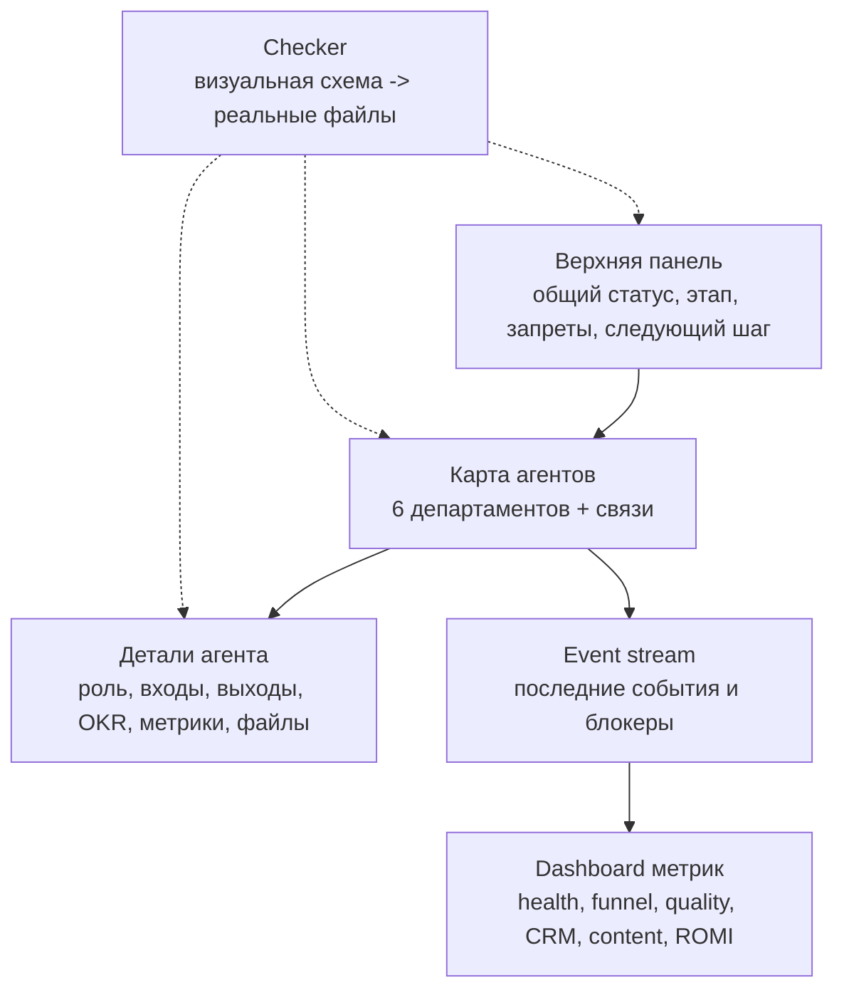

# Admin Dashboard Spec

Дата: 2026-05-08

Статус: ТЗ первой админ-панели управления многоагентной системой по модели урока 5. Код панели не создавался, внешние сервисы не подключались, новые агенты не создавались.

Источник правил:

- `../../lessons/system/multi-agent-visual-dashboard-description-2026-05-08.md`
- `../../lessons/system/lesson-5-turnkey-agent-org-chart.md`
- `../../lessons/system/lesson-5-part-2-product-system-rules-2026-05-07.md`
- `docs/multi-agent-visual-control-map.md`
- `docs/agent-okr-and-checker-map.md`
- `docs/chief-of-staff-handoff-protocol.md`
- `research/external-mas-ip-analysis-2026-05-15.md`
- `docs/lecturer-mas-reference-comparison-2026-05-17.md`
- `docs/agent-subroles-and-kpi-map.md`
- `docs/agent-scenario-artifact-contract.md`

## 1. Цель панели

Админ-панель нужна не для красоты. Это пульт, где видно:

- какие 6 агентских департаментов существуют;
- кто сейчас выступает координатором / Chief of Staff;
- какой агент за что отвечает;
- где вход, выход и следующий шаг;
- где task-handoff, agent-result и escalation-to-yana;
- какие очереди, отчёты и тесты уже проверены;
- где система заблокирована;
- что можно делать безопасно прямо сейчас;
- что нельзя запускать без отдельного подтверждения.

Простыми словами: панель должна отвечать на вопрос “можно ли сейчас запускать следующий шаг, и если нельзя, то почему?”.

## 2. Что не делаем в первой версии

- Не запускаем `orchestrator/scheduler.py`.
- Не запускаем массовый сбор лидов.
- Не публикуем реальные посты.
- Не отправляем реальные outreach-сообщения.
- Не показываем значения секретов из `.env`.
- Не создаём Agent 7.
- Не подключаем платные API.
- Не делаем авторизацию, Supabase Realtime и live UI до локального JSON-слоя.

## 3. Модель из урока 5 для нашего проекта

В уроке 5 логика такая:

```text
главный оркестратор -> департаменты -> агенты -> входы/выходы -> проверяемый результат -> метрики -> REPORT
```

Для `design-studio-lead-engine` это выглядит так:

```text
CLAUDE.md / AGENTS.md
-> REPORT.md
-> 6 агентских департаментов
-> Redis / reports / CRM / notifications
-> checker
-> следующий маленький шаг
```

## 4. Общая схема экрана



## 5. Верхняя панель

Верхняя панель показывает общий статус системы.

| Поле | Что показывает | Источник данных | Если нет данных |
|---|---|---|---|
| `project_name` | `design-studio-lead-engine` | `README.md` | `нет данных` |
| `overall_status` | `OK`, `NEEDS_REVIEW`, `BLOCKED`, `LOCKED` | checker report + последний `REPORT.md` | `NEEDS_REVIEW` |
| `current_stage` | текущий маленький этап | `REPORT.md` | `нет данных` |
| `last_checked_at` | когда был последний checker | `data/reports/agent_okr_contract_check.json` | `нет данных` |
| `next_small_step` | один следующий шаг | `REPORT.md` / `docs/multi-agent-visual-control-map.md` | `нет данных` |
| `locks` | что запрещено запускать | `AGENTS.md`, `CLAUDE.md` | всё опасное считать locked |
| `external_calls` | были ли внешние вызовы | `data/reports/*.json` | `нет данных` |

### Быстрые индикаторы

| Индикатор | Значение |
|---|---|
| `scheduler_locked` | по умолчанию `true`, пока отдельно не разрешено |
| `mass_collection_locked` | по умолчанию `true` |
| `real_publish_locked` | по умолчанию `true` |
| `real_outreach_locked` | по умолчанию `true` |
| `secrets_visible` | всегда `false` |

## 6. Карта агентов

Центральная часть панели показывает 6 департаментов, а не десятки хаотичных файлов.

| Агент | Департамент | Статус первой панели | Что видно на карте |
|---|---|---|---|
| Agent 1 Scout | Разведка источников | `planned/manual` | source cards, handoff в Agent 2/4/5 |
| Agent 2 Collector | Сбор лидов | `partial` | активный источник, ошибки источника, `RawLead` |
| Agent 3 Processor | Обработка и скоринг | `tested_partial` | raw -> qualified, score, LLM/dry_run |
| Agent 4 Publisher | Контент и доверие | `dry_run/manual` | drafts, approval, content events |
| Agent 5 CRM | CRM и аналитика | `tested` | Bitrix24, Telegram, reports, ROMI MVP |
| Agent 6 Outreach | Первое касание | `planned/locked` | candidates, approval, sender, interested replies |

### Связи на карте

| Связь | Что передаётся | Формат / место |
|---|---|---|
| Agent 1 -> Agent 2 | source card для сбора | future research/table |
| Agent 1 -> Agent 4 | боли, темы, конкуренты | `content/library/sources/*`, research |
| Agent 1 -> Agent 5 | новые каналы аналитики | `content/library/sources/channel-registry-mvp.csv` |
| Agent 2 -> Agent 3 | сырой лид | Redis `leads:raw` |
| Agent 3 -> Agent 5 | квалифицированный лид | Redis `leads:qualified` |
| Agent 4 -> Agent 5 | событие контента | Redis `content:published` |
| Agent 6 -> Agent 5 | заинтересованный диалог | Redis `leads:outreach` |
| Agent 5 -> Bitrix24 | лид / сделка / статус | Bitrix24 REST |
| Agent 5 -> Telegram | уведомление менеджеру | Telegram Bot API |

## 7. Детали агента

При выборе агента справа открывается карточка.

| Блок | Что показывает |
|---|---|
| Роль | простое описание задачи агента |
| Входы | откуда агент получает данные |
| Выходы | что агент обязан передать дальше |
| OKR | ожидаемый конечный результат |
| Метрики | 3-7 чисел качества |
| Скиллы | какие навыки нужны агенту |
| MCP/API | какие интеграции нужны или planned |
| Файлы | физический путь к агенту |
| Последний тест | какой скрипт проверял агента |
| Последняя ошибка | если есть безопасный отчёт |
| Следующее действие | один маленький шаг для этого агента |

### Статусы деталей

| Статус | Значение |
|---|---|
| `OK` | файл/метрика/связь есть и проверены |
| `PLANNED` | слой нужен позже, но не блокирует MVP |
| `BLOCKED` | есть блокер: ключ, Redis, баланс, доступ, approval |
| `NO_DATA` | в файлах нет подтверждения |
| `LOCKED` | специально запрещено запускать без человека |

## 8. Event stream

Event stream - это нижняя лента событий. Она нужна, чтобы видеть историю без чтения всех файлов.

| Поле события | Что хранить |
|---|---|
| `event_id` | локальный ID события |
| `created_at` | время события |
| `agent` | Agent 1-6 или checker |
| `event_type` | тип события |
| `status` | `OK`, `FAILED`, `BLOCKED`, `DRY_RUN`, `NOT_RUN` |
| `summary` | коротко человеческим языком |
| `report_file` | ссылка на JSON/Markdown отчёт |
| `external_calls` | только `True/False`, без секретов |
| `next_action` | что сделать дальше |

### Типы событий

| Тип | Пример |
|---|---|
| `checker_completed` | visual map и файлы совпали |
| `raw_lead_created` | тестовый RawLead создан |
| `lead_qualified` | Agent 3 выдал score |
| `crm_lead_created` | Agent 5 создал тестовый лид |
| `telegram_notified` | уведомление менеджеру ушло |
| `content_draft_ready` | Agent 4 сделал dry-run |
| `approval_required` | требуется решение человека |
| `task_handoff_created` | координатор передал задачу агенту |
| `agent_result_received` | агент вернул результат в едином формате |
| `escalation_to_yana` | нужно решение Яники |
| `weekly_digest_ready` | готов недельный итог Agent 5/dashboard |
| `blocked` | API key empty, balance low, Redis unavailable |

## 9. Dashboard метрик

Dashboard метрик нужен, чтобы видеть не активность ради активности, а результат.

| Блок | Метрики |
|---|---|
| Agent health | `agent_contract_status`, `visual_map_status`, `admin_dashboard_spec_status`, последний тест |
| System scope | 17 каналов всего, 9 каналов первой волны, 8 planned-каналов, 7 контентных поверхностей |
| Lead funnel | pipeline health 1/1, покрытие wave_1 1/9, покрытие Agent 2 1/4, месячный пилот 0/20, Bitrix24 тесты 4 |
| Quality | score-категории 1/4, режимы скоринга 2/2, ошибочные hot-лиды после реальной выборки не выше 10% |
| CRM SLA | цепочка урока 5 5/6, Bitrix24 OK, Telegram OK, не хватает personal КП/landing status и visit_count/visitor_id |
| Content | поверхности 5/7, черновики 0/5, темы 0/20, полный план позже 0/52, поля согласования 3/3 |
| Outreach | источники 2/2, кандидаты 0/10, черновики 0/5, outreach->CRM 0/1, отправки без approval 0 |
| ROMI | канал -> расход -> лид -> сделка -> выручка -> profit -> ROMI |
| Safety | сколько действий осталось locked, были ли внешние вызовы |

## 9.1 Chief of Staff, handoff и weekly digest

Этот блок добавлен после анализа внешнего референса `petukhova2023-bit/dz-ai-day-5`, но без копирования его структуры и без расширения до 26 агентов.

В первой версии панели это только информационный слой:

| Блок | Что показывает | Источник |
|---|---|---|
| Chief of Staff | кто координирует текущую задачу и какой выбран маршрут | `CLAUDE.md`, `AGENTS.md`, `docs/chief-of-staff-handoff-protocol.md` |
| Task handoff | от кого, кому, цель, контекст, формат результата, риски | future local report / docs |
| Agent result | что сделано, статус, отчёты, риски, следующий шаг | `data/reports/*.json`, `REPORT.md` |
| Escalation-to-yana | решения, которые нельзя принимать автоматически | `docs/chief-of-staff-handoff-protocol.md` |
| Weekly digest | недельный итог лидов, CRM, контента, ROMI и блокеров | Agent 5/dashboard позже |

Правило для панели:

```text
Агент = роль / ответственность.
Skill = действие, которое помогает агенту выполнить роль.
```

Поэтому новые skills добавляются к существующим 6 агентам, а не превращаются в новых агентов.

## 9.2 Слой из внешней MAS-модели 193.233.131.92

Этот блок добавлен после безопасного read-only анализа внешнего референса `http://193.233.131.92/`, зафиксированного в `research/external-mas-ip-analysis-2026-05-15.md`.

### О чём их модель простыми словами

Их модель — это не система лидогенерации под проектную организацию. Это универсальный операционный центр многоагентной компании:

```text
пользовательская задача
-> Chief Orchestrator
-> департаменты
-> специализированные агенты
-> сценарий выполнения
-> артефакт результата
-> проверка / следующий шаг
```

То есть она показывает не просто “список агентов”, а как задача проходит через систему. Главная ценность для нас — не их 23 агента и 4 OSINT-роли, а способ управления:

- есть единый главный координатор;
- у каждого агента есть карточка ответственности;
- у каждого этапа есть статус;
- у каждого сценария есть последовательность шагов;
- у каждого шага должен появиться проверяемый артефакт;
- оператор может кликнуть по агенту и понять, что он делает;
- позже можно добавить чат, который понимает контекст выбранного агента.

### Что берём в нашу систему

| Элемент внешней модели | Как применяем у нас | Где показывать |
|---|---|---|
| `Chief Orchestrator` | `CLAUDE.md / AGENTS.md` + Chief of Staff protocol как смысловой оркестратор | верхняя панель и центр карты |
| Департаменты | только наши 6 агентов, без расширения до 23+ ролей | карта агентов |
| Agent Inspector | карточка выбранного агента: роль, входы, выходы, правила, KPI, файлы, блокеры | правая панель |
| Scenario Timeline | сценарии сквозной проверки: лид, тендер, контент, CRM hygiene, ROMI | нижняя timeline-панель |
| Artifact Tracker | доказательство результата каждого этапа | отдельный блок в деталях сценария |
| Status model | `locked`, `manual`, `ready`, `queued`, `running`, `needs_review`, `failed`, `done` | карта, события, детали агента |
| OSINT-модуль | не новый агент, а протокол внутри Agent 1 Scout и Agent 5 CRM | карточки Agent 1/5 и сценарий проверки |
| Context chat | будущий `AI Operator Chat`, не MVP | future-layer после read-only dashboard |

### Обязательные сценарии для панели

Панель должна уметь показывать не абстрактные демо-сценарии, а наши реальные пути:

| Сценарий | Timeline |
|---|---|
| Первый входящий запрос | `сайт / MAX / Telegram / email -> AI-менеджер -> Agent 3 -> Agent 5 -> Bitrix24 сделка -> человек` |
| Тендерный лид | `Gmail tender -> Agent 2 -> Agent 3 -> Agent 5 -> Bitrix24 -> analytics` |
| Контентный сигнал | `Agent 1 Scout -> Agent 4 Publisher -> content event -> Agent 5 -> ROMI later` |
| CRM hygiene | `Bitrix24 audit -> Agent 5 -> duplicate queue -> human cleanup` |
| ROMI | `source -> lead -> deal -> revenue -> channel -> profit -> ROMI` |

### Обязательные артефакты

Каждый этап считается закрытым только если есть проверяемый артефакт.

| Этап | Артефакт |
|---|---|
| Agent 1 Scout | `source_signal_card` |
| Agent 2 Collector | `raw_lead` |
| Agent 3 Processor | `qualified_lead` |
| AI-менеджер | `intake_card` |
| Agent 4 Publisher | `content_draft` или `published_content_event` |
| Agent 5 CRM | `bitrix_deal` или `crm_hygiene_report` |
| Agent 5 Analytics | `channel_report` или `romi_report` |
| Agent 6 Outreach | `approved_reply` или `outreach_lead` |
| Checker | `agent_okr_contract_check.json` |

### Status model для нашей панели

| Статус | Значение |
|---|---|
| `locked` | запуск запрещён без отдельного подтверждения или не заполнены обязательные доступы |
| `manual` | этап ведётся руками, автоматизация ещё не включена |
| `ready` | можно запускать безопасный dry-run |
| `queued` | задача ожидает обработки |
| `running` | этап выполняется сейчас |
| `needs_review` | нужен человек для проверки качества или решения |
| `failed` | этап упал, нужна диагностика минимальной сломанной части |
| `done` | этап завершён и есть артефакт |

### OSINT-протокол без нового агента

OSINT из референса полезен для нас как метод проверки, но не как отдельный Agent 7.

Где использовать:

- Agent 1 Scout: конкуренты, источники, отзывы, карты, публичные сигналы спроса;
- Agent 5 CRM: проверка крупного B2B-заказчика или сомнительной сделки;
- future MCP/API preflight: только после MVP и отдельного разрешения.

Минимальные правила:

- важный факт подтверждать 2-3 источниками;
- хранить URL, дату проверки и уровень доверия;
- не использовать серые методы, взлом, утечки и закрытые персональные данные;
- не делать автоматический вывод “работать / не работать” без человека;
- для крупной сделки отдавать человеку короткий risk-summary.

### AI Operator Chat — только later

Идея чата из референса: оператор выбирает агента, а чат понимает контекст этого агента.

Пример:

```text
выбран Agent 5 -> чат отвечает про CRM, Bitrix24, сделки, ROMI
выбран Agent 4 -> чат отвечает про контент, публикации, approval
выбран Agent 1 -> чат отвечает про источники, конкурентов, сигналы рынка
```

На MVP это не делаем. Сначала нужен read-only dashboard из локальных JSON/Markdown. Чат добавлять только позже, когда будут:

- правила доступа;
- запрет на показ секретов;
- контроль стоимости LLM;
- журнал запросов;
- режим dry-run;
- ручное подтверждение внешних действий.

## 9.3 Слой из промпта лектора по визуализации AI-компании

Этот блок добавлен после анализа учебного промпта лектора про AI Orchestrator, департаменты, specialist nodes, artifact nodes и scenario playback.

Главный вывод:

```text
Нам не нужны новые агенты.
Нам нужен более строгий data-contract: сценарий -> шаг -> агент -> артефакт -> статус -> проверка.
```

Что уже есть:

- главный смысловой оркестратор: `CLAUDE.md / AGENTS.md`;
- память: `REPORT.md`;
- 6 агентских департаментов;
- OKR и метрики;
- checker;
- локальный dashboard JSON/Markdown/HTML.

Что усилить позже:

| Слой из промпта лектора | Как применить у нас |
|---|---|
| `Artifact node` | сделать артефакты первичными: `SignalCard`, `RawLead`, `QualifiedLead`, `approval_card`, `crm_payload`, `romi_report` |
| `Scenario playback` | сначала описать сценарии в Markdown/JSON, UI-анимацию делать позже |
| `InspectorPanel` | добавить `last_artifact`, `blocker`, `needs_yanika`, `external_calls` |
| `StatusLegend` | использовать единый словарь статусов для лидов, контента, CRM и тестов |
| `agentSystemData.ts` | для нас позже лучше `agent_scenario_artifact_contract.json`, чтобы не привязываться к React до MVP |

Первые сценарии для панели:

| Сценарий | Timeline |
|---|---|
| Первый входящий запрос | `сайт / MAX / Telegram / email -> AI-менеджер -> Agent 3 -> Agent 5 -> Bitrix24 -> человек` |
| Контент даёт лид | `Agent 1 signal -> Agent 4 post -> public metrics -> inbound question -> Agent 5 analytics` |
| Тендерный лид | `Gmail tender -> Agent 2 -> Agent 3 -> Agent 5 -> Bitrix24 -> человек` |
| ROMI канала | `source -> cost -> lead -> deal -> revenue -> profit -> ROMI` |

Запрет:

```text
Не переносить 9 департаментов лектора как новые папки.
Strategy, Marketing, Content, Design, Development, Production, Analytics и Operations должны лечь внутрь наших 6 агентов как роли и skills.
```

Безопасный шаг выполнен: создан `docs/agent-scenario-artifact-contract.md` без запуска кода, внешних сервисов и публикаций.

Статус на 2026-05-17: контракт создан и подключается к dashboard как `scenario_artifact_contract`. Суброли зафиксированы в `docs/agent-subroles-and-kpi-map.md`.

### 9.3.1 Суброли внутри 6 агентов

Суброли показываются в карточке агента, но не являются новыми агентами.

| Агент | Что добавлено |
|---|---|
| Agent 1 Scout | Market Research Agent, Competitor Analyst, Source Radar, Reviews/Maps Monitor, Demand Signal Curator |
| Agent 2 Collector | Tender/Email Collector, Marketplace Collector, Directory Collector, Lead Normalizer, Duplicate Guard |
| Agent 3 Processor | Cleaner, Enricher, Scorer, Offer/Next-Step Architect, QA Classifier |
| Agent 4 Publisher | Content Strategist, Copywriter, Editor, Visual/Media Brief Creator, Approval Coordinator, Content Metrics Analyst |
| Agent 5 CRM | CRM Router, Notifier, Attribution Agent, ROMI Reporter, CRM Hygiene Analyst, Weekly Digest Owner |
| Agent 6 Outreach | Social Listening Monitor, Candidate Qualifier, Reply Draft Writer, Approval Gatekeeper, Outreach Sender, Dialog Converter |

Правило для панели:

```text
Суброль должна иметь ответственность, артефакт и KPI.
Если у роли нет отдельного артефакта, это skill, а не суброль.
```

### 9.3.2 Scenario Artifact Contract

Dashboard должен показывать отдельный блок `Scenario Artifact Contract`.

Минимально он показывает:

- документ-источник `docs/agent-scenario-artifact-contract.md`;
- документ субролей `docs/agent-subroles-and-kpi-map.md`;
- сценарии;
- timeline каждого сценария;
- обязательные артефакты;
- статус MVP;
- запреты;
- единый `Status model`.

Главное правило:

```text
этап закрыт только если есть input, output_artifact, status, verification и next_step
```

## 10. Checker-блок

Checker в первой версии не является Agent 7. Это локальный контрольный слой:

```text
scripts/check_agent_okr_contract.py
```

Он должен проверять:

- существуют ли 6 агентских папок;
- есть ли у 6 агентов верхние `__init__.py`;
- есть ли OKR и метрики;
- есть ли упоминания агентов в `CLAUDE.md`;
- есть ли Redis-очереди;
- есть ли канонический сквозной тест;
- есть ли `docs/multi-agent-visual-control-map.md`;
- есть ли `docs/admin-dashboard-spec.md`;
- содержит ли dashboard spec обязательные блоки урока: верхняя панель, карта агентов, детали агента, event stream, dashboard метрик.

Ожидаемый безопасный вывод:

```text
agent_contract_status=OK
visual_map_status=OK
admin_dashboard_spec_status=OK
missing_agent_files=[]
missing_okr_blocks=[]
missing_metric_blocks=[]
missing_visual_map_items=[]
missing_admin_dashboard_items=[]
external_calls=redis:False,bitrix24:False,telegram_send:False,imap:False,llm:False,scheduler:False,publisher:False
```

## 11. Данные для первой версии

Первая версия панели может жить без базы и без веб-сервера. Достаточно читать локальные файлы.

| Данные | Где брать |
|---|---|
| Правила | `AGENTS.md`, `CLAUDE.md` |
| Память | `REPORT.md` |
| Карта | `docs/multi-agent-visual-control-map.md` |
| OKR | `agents/agent*/__init__.py`, `docs/agent-okr-and-checker-map.md` |
| Проверки | `data/reports/*.json` |
| Очереди | позже безопасный Redis status report, без запуска scheduler |
| Секреты | только SET/EMPTY из отдельного safe env report |

## 12. Волны внедрения

| Волна | Что сделать | Что не делать |
|---|---|---|
| 0 | Этот Markdown spec + checker | не писать UI |
| 1 | Локальный `agent_dashboard.json` из файлов и reports | не подключать внешние API |
| 2 | Статический HTML dashboard из JSON | не делать live-запуски |
| 2.1 | Перемещаемая карта агентов внутри HTML dashboard | не сохранять позиции в проектные файлы без отдельного решения |
| 2.2 | Agent Inspector, Scenario Timeline, Artifact Tracker и Status model по MAS-референсу | не добавлять новых агентов и не подключать чат/API |
| 3 | Кнопки безопасных dry-run тестов | не запускать scheduler без подтверждения |
| 4 | Live-метрики Redis/CRM/ROMI | только после MVP и правил безопасности |

## 13. Первый экран будущей панели

Первый экран должен быть максимально простой:

```text
Верх: общий статус + следующий шаг + запреты
Центр: 6 агентов карточками
Отдельный визуальный блок: перемещаемая карта агентов
Справа: детали выбранного агента
Низ: последние события
Отдельная вкладка: метрики
```

Перемещаемая карта агентов в текущем HTML-viewer работает только локально:

```text
data/reports/agent_dashboard.html -> блок "Перемещаемая карта агентов"
в центре главный агент-оркестратор, вокруг него 6 агентов
на каждой карточке: название, описание, скиллы, OKR, что доделать, процент готовности
карточки можно двигать мышкой/трекпадом как на доске Obsidian
позиции сохраняются только в браузере
кнопка "Сбросить расположение" возвращает стартовую схему
внешние сервисы не запускаются
```

## 14. Один маленький следующий шаг

Статус на 2026-05-10: этот шаг закрыт.

```text
scripts/build_agent_dashboard.py -> data/reports/agent_dashboard.json создан и проверен
scripts/build_agent_dashboard_viewer.py -> data/reports/agent_dashboard.html создан и проверен
scripts/build_agent_dashboard_markdown.py -> data/reports/agent_dashboard.md создан и проверен
Перемещаемая карта агентов добавлена в HTML-viewer и проверяется checker-скриптом
Карта перестроена в формат "главный агент-оркестратор -> 6 агентов -> связи между агентами"
Chief of Staff / Handoff / Escalation / Weekly digest добавлен в JSON, HTML и Markdown dashboard
```

Security Agent Control Layer добавлен в контрольную модель dashboard:

```text
agents/Агент безопастности/AGENT_SECURITY.md -> главный файл безопасности AI-агентов
docs/security-agent-control-layer.md -> объяснение, где применяется слой безопасности
scripts/check_agent_okr_contract.py -> проверяет, что AGENT_SECURITY.md подключён
data/reports/agent_dashboard.json/html/md -> показывает Security Agent Control Layer
```

Это не Agent 7. Security layer не собирает лиды, не пишет контент и не ходит во внешние сервисы. Его задача - остановить опасные действия: секреты, деньги, production, реальные публикации, CRM-действия, MCP/API и LLM-вызовы без подтверждения.

Следующий маленький шаг:

```text
Открыть data/reports/agent_dashboard.html, проверить центрального главного агента, проценты готовности и блок "Что доделать" на каждой карточке.
```

Это должен быть только визуальный контроль. Ничего не запускать: Redis, Bitrix24, Telegram, IMAP, LLM, scheduler, publisher и реальные публикации остаются закрытыми.
