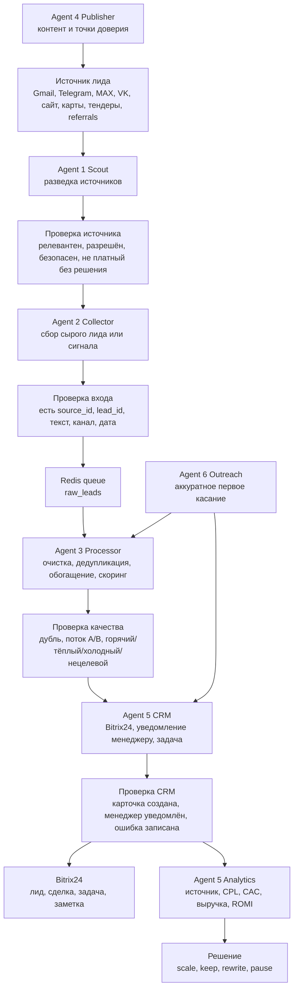

# Warframing сквозного потока лида

Дата: 2026-05-07

Статус: схема перед разработкой и запуском. Новые агенты не создавались. `orchestrator/scheduler.py`, платные API, массовый сбор, реальные публикации и реальные отправки не запускались.

## 1. Главная идея

Система должна не просто “найти лид”, а провести его по понятному маршруту:

```text
источник -> агент -> проверка -> CRM/Bitrix24 -> аналитика
```

Простыми словами:

1. Понимаем, откуда пришёл сигнал.
2. Назначаем правильный агентский отдел.
3. Проверяем, что лид не мусорный и не дубль.
4. Передаём в CRM/Bitrix24 и уведомляем человека.
5. Потом считаем, какой источник реально дал заявки, сделки и деньги.

## 2. Визуальная схема



## 3. Warframing-таблица

| Блок | Что происходит | Кто отвечает | Проверка перед переходом |
|---|---|---|---|
| Триггер | Появился лид, вопрос, заявка, тендер, комментарий или сигнал спроса | Источник / Agent 1 / Agent 2 / Agent 6 | Источник разрешён, не закрытая переписка, не массовый сбор без подтверждения |
| Входные данные | Текст, ссылка, канал, дата, контакт если есть, `source_id` | Agent 2 / Agent 6 | Нет секретов, нет лишних персональных данных, есть минимум для обработки |
| Очередь | Сырой лид попадает в Redis | Agent 2 | Redis доступен, очередь правильная, событие не потеряно |
| Обработка | Очистка, дедупликация, поток A/B, скоринг | Agent 3 | Есть `lead_id`, `source_id`, `score`, `flow`, `next_action` |
| CRM | Создание лида/сделки/задачи в Bitrix24 | Agent 5 | Bitrix24 webhook `SET`, ошибка логируется, менеджер уведомлён |
| Уведомление | Сообщение менеджеру в Telegram | Agent 5 notifier | Telegram bot token `SET`, chat id `SET`, сообщение без секретов |
| Аналитика | Источник связывается с заявкой, сделкой, выручкой и ROMI | Agent 5 analytics_reporter | Есть канал, расход, лиды, сделки, выручка |
| Решение | Масштабировать, оставить, переписать, остановить источник | Человек + Agent 5 | Решение записано в отчёт, следующий шаг понятен |

## 4. Минимальный MVP-поток

Первый сквозной тест должен быть маленьким:

```text
один тестовый сырой лид -> Redis -> Agent 3 -> Agent 5 -> Telegram/Bitrix test -> CSV/report
```

Что не входит в первый тест:

- массовый сбор лидов;
- реальные публикации;
- PostMyPost;
- платные генерации;
- автоматический outreach без ручного согласования;
- запуск всех collectors одновременно.

## 5. Контрольные точки

| Контрольная точка | Что должно быть видно |
|---|---|
| `source_check` | Почему источник можно использовать |
| `raw_lead_check` | Какие поля пришли в сыром лиде |
| `processor_check` | Что Agent 3 решил по лиду |
| `crm_check` | Создана ли карточка в Bitrix24 |
| `notification_check` | Получил ли менеджер уведомление |
| `analytics_check` | Попал ли источник в отчёт |
| `human_check` | Где человек должен подтвердить действие |

## 6. Риски и ограничения

| Риск | Что делаем |
|---|---|
| Пустые `.env` поля | Не запускаем цепочку, пока обязательные ключи не `SET` |
| Источник непроверенный | Сначала manual/dry-run, потом только автоматизация |
| Дубли лидов | Agent 3 обязан проверять дубль до CRM |
| Секреты в логах | В логах и отчётах только статусы, без значений |
| Платный API | Только после отдельного решения по бюджету |
| Автопубликация | Только после ручного approval-cycle |
| Ошибка агента | Не переписывать систему, чинить минимальный сломанный блок |

## 7. Статус готовности

| Элемент | Статус | Комментарий |
|---|---|---|
| Warframing-схема | Готово | Этот документ |
| `.env` обязательные поля | Не закрыто | Часть ключей пока `EMPTY` |
| Redis | Требует отдельной проверки | Не запускался в этом шаге |
| Bitrix24 | Не закрыто | Webhook пока `EMPTY` |
| Telegram manager bot | Не закрыто | Bot token пока `EMPTY`, chat id `SET` |
| Analytics MVP | Частично готово | CSV-аналитика есть, нужны реальные события |
| Первый сквозной тест | Не закрыто | Ждёт `.env`, Redis, Bitrix24/Telegram |

## 8. Следующий маленький шаг

Закрыть обязательные поля `.env` для первого CRM-пути:

```text
TELEGRAM_BOT_TOKEN
BITRIX24_WEBHOOK_URL
ANTHROPIC_API_KEY или LLM_PROVIDER=dry_run для теста без внешней модели
```

После этого отдельно проверить Redis и только потом запускать один тестовый лид.
