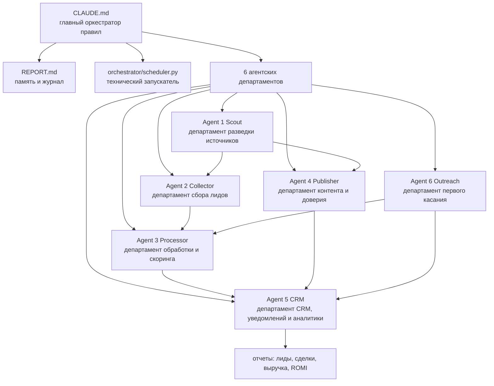

# План запуска lead-engine после урока 5

Дата: 2026-05-06

Статус: план запуска. Новые агенты не создавались. Платные API, реальные публикации, массовый сбор и `orchestrator/scheduler.py` не запускались.

## 1. Главное решение урока 5

Урок 5 для нашего проекта означает простую вещь: не строить ещё больше агентов, а сделать текущую систему управляемой.

Для `design-studio-lead-engine` это значит:

- оставить 6 существующих агентских отделов;
- не создавать Agent 7;
- сначала закрыть один сквозной MVP-тест;
- расширять источники строго по одному;
- добавить `quality-comparator` позже как контроль качества внутри текущих отделов, а не как нового агента.

## 2. Текущая оргструктура как департаменты



Простыми словами:

- `CLAUDE.md` задаёт правила, роли и порядок действий.
- `REPORT.md` хранит память проекта: что уже сделали, что проверили, что осталось.
- `orchestrator/scheduler.py` только запускает технические процессы. Он не главный по смыслу.
- Agent 1 ищет, где могут быть лиды и какие источники важны.
- Agent 2 собирает сырой лид или сигнал.
- Agent 3 чистит, обогащает, оценивает и готовит следующий шаг.
- Agent 4 создаёт контент и точки доверия.
- Agent 5 кладёт лиды в CRM, уведомляет менеджера и считает аналитику.
- Agent 6 делает аккуратное первое касание и передаёт заинтересованных дальше.

## 3. Сверка с блок-схемой лидогенерации

Эталонная блок-схема из lessons:

```text
source-scout -> collector -> processor / enricher -> scorer -> CRM / router -> outreach / responder -> analytics / ROMI
```

| Блок из lessons | Наш департамент | Статус | Чего не хватает |
|---|---|---|---|
| `source-scout` | Agent 1 Scout | Папки есть | Нет регулярного выхода: какие источники передать Agent 2, Agent 4 и Agent 5 |
| `collector` | Agent 2 Collector | Частично есть | Для MVP активен только один источник; остальные collectors не запускать до теста |
| `processor / enricher` | Agent 3 Processor | Есть | Нужен тест на одном сыром лиде после Redis |
| `scorer` | Agent 3 Processor | Есть | Нужен `ANTHROPIC_API_KEY` или безопасный fallback без API |
| `CRM / router` | Agent 5 CRM | Частично есть | Нужны Bitrix24 webhook и Telegram bot token |
| `outreach / responder` | Agent 6 Outreach | Частично есть | Нужны Telegram-сессии и отдельный тест после CRM-пути |
| `analytics / ROMI` | Agent 5 Analytics | MVP CSV есть | Нужно связать реальные лиды, сделки, расходы, выручку и контент |

Вывод: состав агентов правильный. Не хватает не новых агентов, а связки и проверки первого маленького прохода.

## 4. Первый сквозной MVP-тест

Первым нужно закрыть не все источники, а один контролируемый проход:

```text
1 тестовый сырой лид -> Redis -> Agent 3 Processor -> Agent 5 CRM/notifier -> отчет о результате
```

Почему именно так:

- это проверяет сердце системы: лид попал, обработался, получил статус, дошёл до CRM/менеджера;
- не требует массового сбора;
- не требует реальных публикаций;
- позволяет понять, какой конкретно блок ломается, если что-то не сработает.

После этого, отдельным шагом:

```text
Agent 2 tender_collector -> Agent 3 -> Agent 5
```

И только потом:

```text
Agent 6 approval/sender -> Agent 4 content_published -> ROMI analytics
```

## 5. `.env` статусы для первого MVP

Значения секретов не проверялись визуально и не выводились. Использованы только статусы `SET`, `EMPTY`, `MISSING`.

### Обязательные для первого CRM-пути

| Поле | Статус | Зачем нужно |
|---|---|---|
| `ANTHROPIC_API_KEY` | `EMPTY` | Скоринг и оффер Agent 3 |
| `TELEGRAM_BOT_TOKEN` | `EMPTY` | Уведомления менеджеру и approver |
| `TELEGRAM_MANAGER_CHAT_ID` | `SET` | Куда отправлять уведомления |
| `BITRIX24_WEBHOOK_URL` | `EMPTY` | Создание лида/сделки в Bitrix24 |
| `REDIS_URL` | `SET` | Очереди между агентами |
| `DATABASE_URL` | `SET` | Основная база PostgreSQL/Supabase через URL |
| `APP_ENV` | `SET` | Режим работы |

### Нужны для источника Email IMAP/tender_collector

`GMAIL_*` — исторические имена переменных. Для Яндекс.Почты они тоже используются: email пишется в `GMAIL_USER`, пароль приложения — в `GMAIL_APP_PASSWORD`, а сервер задаётся через `IMAP_HOST`.

| Поле | Статус | Зачем нужно |
|---|---|---|
| `IMAP_HOST` | `EMPTY` | IMAP-сервер почты; для Яндекса `imap.yandex.ru` |
| `IMAP_PORT` | `EMPTY` | IMAP-порт; обычно `993` |
| `GMAIL_USER` | `EMPTY` | Почта с тендерами |
| `GMAIL_APP_PASSWORD` | `EMPTY` | Безопасный пароль приложения почты |
| `GMAIL_TENDER_FOLDER` | `SET` | Папка с тендерными письмами |

### Нужны для Telegram-аутрича Agent 6

| Поле | Статус | Зачем нужно |
|---|---|---|
| `TELEGRAM_API_ID` | `SET` | Telethon user account |
| `TELEGRAM_API_HASH` | `EMPTY` | Telethon user account |
| `TELEGRAM_PHONE` | `SET` | Телефон аккаунта |

### Отложенные поля Agent 4 и платных расширений

| Поле | Статус | Решение |
|---|---|---|
| `MAX_BOT_TOKEN` | `EMPTY` | Позже, для публикаций MAX |
| `MAX_CHAT_ID` | `EMPTY` | Позже, для публикаций MAX |
| `MAX_API_BASE_URL` | `SET` | Техническая база MAX |
| `OPENROUTER_API_KEY` | `EMPTY` | Позже, для генерации контента |
| `PUBLISHER_TELEGRAM_BOT_TOKEN` | `EMPTY` | Позже, для публикаций |
| `PUBLISHER_TELEGRAM_CHANNEL_ID` | `EMPTY` | Позже, для публикаций |
| `OPENAI_API_KEY` | `EMPTY` | Позже, изображения |
| `ELEVENLABS_API_KEY` | `EMPTY` | Позже, озвучка |
| `ELEVENLABS_VOICE_ID` | `EMPTY` | Позже, озвучка |
| `REPLICATE_API_TOKEN` | `EMPTY` | Позже, видео |
| `POSTMYPOST_TOKEN` | `EMPTY` | Позже, автопостинг |
| `POSTMYPOST_PROJECT_ID` | `EMPTY` | Позже, автопостинг |
| `POSTMYPOST_INSTAGRAM_ACCOUNT_ID` | `EMPTY` | Позже, Instagram |

## 6. Где позже нужен quality-comparator

`quality-comparator` пока не создаём как нового агента. Это будущий контрольный слой внутри текущих департаментов.

Где он нужен первым:

- Agent 5 `proposal_trigger`: проверять КП перед отправкой менеджеру или клиенту.
- Agent 5 `analytics_reporter`: проверять отчеты по каналам, чтобы цифры сходились с расходами, сделками и выручкой.
- Agent 3 `offer_gen`: сравнивать первый оффер с эталоном: понятно ли, под тот ли источник, есть ли следующий шаг.

Где он нужен позже:

- Agent 4 Publisher: проверять посты, карточки, статьи и будущие Reels-идеи на соответствие бренду и цели лида.
- ROMI по контенту: сравнивать не только просмотры, а путь `контент -> лид -> сделка -> выручка`.

## 7. Проверка LLM-router после ДЗ 4

Идея урока 4 уже поддержана архитектурно: проект не обязан навсегда работать только на одной дорогой модели.

Сейчас в проекте есть:

| Возможность | Где | Статус |
|---|---|---|
| Выбор провайдера | `LLM_PROVIDER` | Есть |
| Сильная модель для важных ответов | `LLM_MODEL_REPLY` | Есть |
| Более дешевая модель для анализа | `LLM_MODEL_ANALYSIS` | Есть |
| Отдельная модель для контента | `LLM_MODEL_CONTENT` | Есть |
| Прямой Claude/Anthropic | `shared/llm_client.py` | Есть |
| OpenRouter как бюджетный/единый вход | `shared/llm_client.py` | Есть |
| Режим без внешней модели | `LLM_PROVIDER=dry_run` | Есть |

Правило:

```text
Массовые фоновые задачи — cheap/dry_run.
Важные ответы, КП, спорные юридические/финансовые формулировки — strong model после отдельного решения.
```

Статус шага: закрыт проверкой кода. Платные API не запускались.

## 8. Где позже нужен Sentry/logging

Sentry/logging нужен, чтобы видеть не “плохой текст”, а технический сбой цепочки.

Позже ставим наблюдение на такие точки:

| Цепочка | Что фиксировать | Ответственный отдел |
|---|---|---|
| Agent 1 Scout -> Agent 2/4 | source card создана, передана, ошибка | Agent 1 |
| Agent 2 Collector -> Redis | источник, количество записей, ошибки сбора | Agent 2 |
| Redis -> Agent 3 Processor | очередь, lead_id, статус обработки | Agent 3 |
| Agent 3 -> Agent 5 | score, route, ошибка передачи | Agent 3 / Agent 5 |
| Agent 4 production | provider, model, cost, dry_run, approval_status | Agent 4 |
| Agent 4 -> Agent 5 analytics | content_id, channel, publish event | Agent 4 / Agent 5 |
| Agent 6 outreach | approval, sender status, reply detected | Agent 6 |

Правило экономии:

```text
Не отправлять в LLM все логи целиком.
Сначала Sentry/logging показывает место сбоя, потом LLM разбирает только короткий фрагмент ошибки.
```

Статус шага: закрыт документально. Sentry не подключался.

## 9. Что не запускаем до первого теста

- Не запускаем весь `orchestrator/scheduler.py`.
- Не запускаем массовый сбор из Avito, Profi, Maps, HH, YouDo, TenChat, VK и форумов.
- Не запускаем Apify, OpenRouter, OpenAI, ElevenLabs, Replicate и PostMyPost без отдельного подтверждения бюджета.
- Не публикуем реальные посты.
- Не создаём новых агентов.
- Не переносим заново архивный `sales_ai`.

## 10. Один ближайший маленький шаг

Закрыть доступы, без которых первый CRM-путь не проверить:

```text
ANTHROPIC_API_KEY
TELEGRAM_BOT_TOKEN
BITRIX24_WEBHOOK_URL
```

После этого можно сделать маленький тест:

```text
один тестовый лид -> Redis -> Agent 3 -> Agent 5 -> Telegram/Bitrix test
```

Статус шага: не закрыт, потому что обязательные `.env` поля ещё `EMPTY`.
