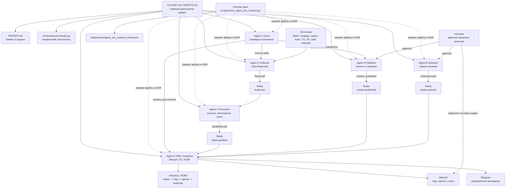

# Multi-Agent Visual Control Map

Дата: 2026-05-08

Статус: рабочая карта управления многоагентной системой по модели урока 5. Новые агенты не создавались, внешние сервисы не подключались, файлы не перемещались и не удалялись.

## 1. Главная модель управления

В этой системе `CLAUDE.md` и `AGENTS.md` являются смысловым оркестратором правил. `orchestrator/scheduler.py` является только техническим запускателем. `REPORT.md` хранит память проекта и проверенные результаты.

```text
CLAUDE.md / AGENTS.md -> правила
REPORT.md -> память и журнал
orchestrator/scheduler.py -> технический запуск
agents/* -> 6 рабочих департаментов
scripts/check_agent_okr_contract.py -> контроль соответствия файлов визуальной схеме
docs/chief-of-staff-handoff-protocol.md -> единый вход задач, handoff, result, escalation, weekly digest
```

Главный доказанный MVP-путь:

```text
RawLead -> Redis leads:raw -> Agent 3 -> Redis leads:qualified -> Agent 5 -> Bitrix24 + Telegram
```

Статус на 2026-05-08: путь доказан тестом `scripts/test_agent3_to_agent5_handoff_local.py`, тестовый лид `832` закрыт.

## 1.1 Внешняя MAS-модель как референс, не как новая архитектура

После безопасного read-only анализа `http://193.233.131.92/` зафиксировано: внешний референс показывает универсальную модель операционного центра многоагентной системы.

Простыми словами, их модель про это:

```text
любой входящий запрос
-> главный оркестратор
-> департамент
-> профильный агент
-> сценарий выполнения
-> проверяемый артефакт
-> контроль качества
-> итог / следующий шаг
```

В их системе много ролей: маркетинг, дизайн, клиентский сервис, продажи, разработка, OSINT. Для нашего проекта это слишком широко. Мы не переносим их 23 агента и 4 OSINT-роли.

Что берём:

| Элемент референса | Что это значит | Как применяем у нас |
|---|---|---|
| Chief Orchestrator | единая точка входа и маршрутизации | `CLAUDE.md / AGENTS.md` + Chief of Staff protocol |
| Agent Inspector | карточка роли агента | правая панель будущего dashboard |
| Scenario Timeline | путь задачи по шагам | сценарии лида, тендера, контента, CRM hygiene, ROMI |
| Artifact Tracker | результат каждого этапа | `raw_lead`, `qualified_lead`, `intake_card`, `bitrix_deal`, `romi_report` |
| Status model | видно, где задача стоит | `locked`, `manual`, `ready`, `queued`, `running`, `needs_review`, `failed`, `done` |
| OSINT-модуль | проверка фактов и рисков | протокол внутри Agent 1 Scout и Agent 5 CRM, не Agent 7 |
| Context chat | чат понимает выбранного агента | future-layer после read-only dashboard |

Главное правило:

```text
Референс улучшает управление нашей системой, но не меняет состав агентов.
У нас остаются 6 агентов + checker как контрольный слой, не Agent 7.
```

## 2. Список департаментов проекта

| Уровень | Департамент | Что делает | Физическое место |
|---|---|---|---|
| Управление | Оркестрация правил / Chief of Staff | правила, запреты, вход задач, маршрутизация, память | `CLAUDE.md`, `AGENTS.md`, `REPORT.md`, `docs/chief-of-staff-handoff-protocol.md` |
| Runtime | Технический запуск | расписание, фоновые потоки, запуск MVP-цепочки | `orchestrator/scheduler.py` |
| Agent 1 | Разведка источников | ищет источники, конкурентов, боли, офферы | `agents/agent1_scout/` |
| Agent 2 | Сбор лидов | собирает сырой лид и кладёт в Redis | `agents/agent2_collector/` |
| Agent 3 | Обработка и скоринг | чистит, обогащает, скорит и формирует следующий шаг | `agents/agent3_processor/` |
| Agent 4 | Контент и доверие | готовит контент, визуалы, точки доверия, события публикаций | `agents/agent4_publisher/` |
| Agent 5 | CRM и аналитика | создаёт Bitrix24 лид, уведомляет менеджера, считает отчёты | `agents/agent5_crm/` |
| Agent 6 | Аутрич | находит обсуждения, готовит ответ, ждёт approval, передаёт интерес | `agents/agent6_outreach/` |
| Checker | Контроль соответствия | сверяет схему с реальными файлами | `scripts/check_agent_okr_contract.py` |

## 3. Список агентов и подагентов по департаментам

| Департамент | Основной агент | Подагенты / модули | Статус |
|---|---|---|---|
| Разведка | Agent 1 Scout | `avito_spy`, `maps_spy`, `review_monitor`, `tender_intel` | Папки есть, runtime не подключён |
| Сбор | Agent 2 Collector | `tender_collector`, `avito_collector`, `profi_collector`, `ya_uslugi_collector`, `maps_collector`, `hh_collector`, `youdo_collector`, `property_signal` | Активный MVP-фокус - IMAP/tender, остальные по одному позже |
| Обработка | Agent 3 Processor | `cleaner`, `enricher`, `scorer`, `offer_gen` | Реализован, проверен без LLM в сквозном тесте |
| Контент | Agent 4 Publisher | `core/llm`, `core/image`, `core/carousel`, `core/stories`, `core/stickers`, `core/voice`, `core/video`, `core/event_bus`, `posters/*`, `cli.py` | Есть dry-run и адаптеры, реальные публикации только после подтверждения |
| CRM | Agent 5 CRM | `bitrix`, `notifier`, `analytics_reporter`, `proposal_trigger`, `stats_reporter`, `admin_bot` | Bitrix24 + Telegram проверены, ROMI слой частично |
| Аутрич | Agent 6 Outreach | `tg_monitor`, `tg_hunter`, `vk_monitor`, `vk_hunter`, `forum_monitor`, `forum_hunter`, `max_monitor`, `tenchat_monitor`, `tenchat_hunter`, `yandex_q_monitor`, `relevance`, `responder`, `approver`, `sender`, `lead_detector`, `cold_email`, `sales_dialog`, `ab_tester` | Код частично есть, полный outreach-тест позже |
| Контроль | Checker layer | `check_agent_okr_contract.py` | Создан и прошёл `agent_contract_status=OK` |

### 3.1 Суброли по модели лектора без создания Agent 7

После анализа примера лектора добавлен слой субролей. Это не новые агенты и не новые runtime-папки. Это рабочие роли внутри 6 существующих департаментов.

Физический документ: `docs/agent-subroles-and-kpi-map.md`.

| Агент | Суброли |
|---|---|
| Agent 1 Scout | Market Research Agent, Competitor Analyst, Source Radar, Reviews/Maps Monitor, Demand Signal Curator |
| Agent 2 Collector | Tender/Email Collector, Marketplace Collector, Directory Collector, Lead Normalizer, Duplicate Guard |
| Agent 3 Processor | Cleaner, Enricher, Scorer, Offer/Next-Step Architect, QA Classifier |
| Agent 4 Publisher | Content Strategist, Copywriter, Editor, Visual/Media Brief Creator, Approval Coordinator, Content Metrics Analyst |
| Agent 5 CRM | CRM Router, Notifier, Attribution Agent, ROMI Reporter, CRM Hygiene Analyst, Weekly Digest Owner |
| Agent 6 Outreach | Social Listening Monitor, Candidate Qualifier, Reply Draft Writer, Approval Gatekeeper, Outreach Sender, Dialog Converter |

Правило:

```text
агент = владелец результата;
суброль = внутренняя роль;
skill = действие;
артефакт = доказательство, что этап закрыт.
```

Суброль можно повышать до отдельного агента только позже, если у неё появятся отдельная очередь, отдельный тест, отдельный риск, отдельные KPI и отдельный бюджет. Сейчас этого нет, поэтому состав остаётся 6 агентов.

### 3.2 Scenario Artifact Contract

Физический документ: `docs/agent-scenario-artifact-contract.md`.

Контракт показывает рабочие сценарии:

| Сценарий | Timeline |
|---|---|
| Первый входящий запрос | `сайт / MAX / Telegram / email -> intake_card -> Agent 3 -> Agent 5 -> crm_payload_preview -> человек` |
| Контент даёт лид | `SignalCard -> content_brief -> content_draft -> approval_card -> content_metric_event -> Agent 5 analytics` |
| Тендерный лид | `Gmail / IMAP tender -> Agent 2 -> raw_lead -> Agent 3 -> qualified_lead -> Agent 5` |
| ROMI канала | `source -> cost -> lead -> deal -> revenue -> profit -> ROMI -> channel_decision` |

Главное правило:

```text
этап закрыт только если есть input, output_artifact, status, verification и next_step.
```

## 4. Связи между агентами

| Откуда | Куда | Что передаёт | Канал / файл | Проверка |
|---|---|---|---|---|
| Agent 1 Scout | Agent 2 Collector | source cards, где собирать лиды | future research/table | пока ручной слой |
| Agent 1 Scout | Agent 4 Publisher | боли, офферы, темы, конкуренты | `content/library/sources/*`, research docs | пока ручной слой |
| Agent 1 Scout | Agent 5 CRM | новые источники для аналитики | `channel-registry-mvp.csv` позже | пока ручной слой |
| Agent 2 Collector | Agent 3 Processor | `RawLead` | Redis `leads:raw` | `redis_push_raw_status=OK` |
| Agent 3 Processor | Agent 5 CRM | `QualifiedLead` | Redis `leads:qualified` | `qualified_output_status=OK` |
| Agent 4 Publisher | Agent 5 CRM | факт публикации / content event | Redis `content:published` | проверить после контент-теста |
| Agent 6 Outreach | Agent 5 CRM | `OutreachLead` или converted `QualifiedLead` | Redis `leads:outreach` | полный outreach-тест позже |
| Agent 5 CRM | Bitrix24 | карточка лида, статус, комментарий | REST webhook | проверено, лид `832` был создан и закрыт |
| Agent 5 CRM | Telegram | уведомление менеджеру | Telegram Bot API | проверено |
| Checker | Все агенты | статус файлов, OKR, метрик, очередей | local read-only script | `agent_contract_status=OK` |

## 5. Mermaid-схема всей системы



## 6. Markdown-таблица агентов

| Агент | Роль | Входы | Выходы | OKR | Метрики | Skills | MCP/API | Файл |
|---|---|---|---|---|---|---|---|---|
| Agent 1 Scout | Разведка источников | конкуренты, отзывы, площадки, спрос | source cards для Agent 2/4/5 | проверенные источники и следующий шаг | карта источников 17/17; wave_1 9/9; planned 8/8; source cards 0/9 | web research, competitive analysis, review analysis, spreadsheet/report writing | Browser Use позже, Context7, web-scraping/Firecrawl/Apify позже | `agents/agent1_scout/__init__.py` |
| Agent 2 Collector | Сбор лидов | один разрешённый источник | `RawLead` в `leads:raw` | собрать сырой лид без смешивания тестов и реальных данных | источники Agent 2 4/4; проверенный сбор 1/4; тестовые RawLead 1/4; месячный пилот 0/20 | email parsing, web scraping позже, data normalization, source tagging | IMAP, Redis, Playwright/Apify позже | `agents/agent2_collector/__init__.py` |
| Agent 3 Processor | Обработка и скоринг | `RawLead` из Redis | `QualifiedLead` в `leads:qualified` | квалифицировать лид и выдать score/offfer/next_action | сквозной тест 1/1; wave_1 покрытие 1/9; режимы скоринга 2/2; score-категории 1/4 | data cleaning, entity extraction, lead scoring, prompt design, QA cases | Redis, LLM router, OpenRouter-first/dry_run | `agents/agent3_processor/__init__.py` |
| Agent 4 Publisher | Контент и доверие | тема, бренд, approval, план | черновик, публикация, `content:published` | создать согласованный контент и передать факт в аналитику | поверхности 5/7; черновики недели 0/5; темы месяца 0/20; полный план позже 0/52 | copywriting, SEO, visual prompts, UTM, social publishing | `shared/llm_client.py` -> OpenRouter-first/dry_run, image route, voice later, Replicate, PostMyPost, MAX API, Redis event bus - всё по подтверждению | `agents/agent4_publisher/__init__.py` |
| Agent 5 CRM | CRM и аналитика | `QualifiedLead`, `OutreachLead`, content event | Bitrix24 лид, TG уведомление, отчёт | доставить лид в CRM и дать менеджеру следующий шаг | каналы аналитики 17/17; wave_1 9/9; CRM-тест 1/1; цепочка урока 5 5/6; CR visit->deal 0/1 | Bitrix24 integration, CRM design, attribution, reporting, alerts | Bitrix24 REST, Telegram Bot API, CSV, future Supabase/Sheets/dashboard | `agents/agent5_crm/__init__.py` |
| Agent 6 Outreach | Первое касание | чаты, комментарии, кандидаты | approved reply, `OutreachLead` | безопасно довести интерес до CRM после approval | источники 2/2; кандидаты 0/10; черновики 0/5; outreach->CRM 0/1; отправки без approval 0 | social listening, outreach writing, approval workflow, sales dialogue, compliance | Telethon, Telegram Bot API, VK API, forums, MAX/TenChat позже | `agents/agent6_outreach/__init__.py` |
| Checker layer | Контроль структуры | файлы проекта и визуальная карта | JSON-отчёт соответствия | доказать, что схема совпадает с файлами | `agent_contract_status`, `visual_map_status`, `missing_agent_files`, `missing_okr_blocks`, `missing_metric_blocks`, `missing_visual_map_items`, `canonical_test_status` | QA, file audit, contract checking | нет внешних API | `scripts/check_agent_okr_contract.py` |

## 7. Карточки агентов

### Agent 1 Scout

| Поле | Значение |
|---|---|
| Роль | Разведка источников, конкурентов, боли рынка, офферов и каналов спроса. |
| Входы | Рынок, конкуренты, отзывы, карты, тендерные площадки, ручные исследования. |
| Выходы | Source cards: `source_id`, `channel`, `why_interesting`, `owner_agent`, `next_action`. |
| OKR | Регулярно выдаёт проверенные источники и передаёт их Agent 2/4/5. |
| Метрики | 17/17 каналов в карте источников; 9/9 каналов первой волны; 8/8 planned-каналов; 0/9 source cards первой волны; 0/5 личных каналов Яники. |
| Skills | Web research, competitive analysis, review analysis, tender intelligence, spreadsheet/report writing. |
| MCP/API | Browser Use, Context7; позже Firecrawl/Apify только после лимитов. |
| Файл | `agents/agent1_scout/__init__.py` |

### Agent 2 Collector

| Поле | Значение |
|---|---|
| Роль | Сбор сырых лидов и сигналов из одного разрешённого источника за раз. |
| Входы | IMAP/tender email, позже Avito, Profi, карты, HH, YouDo, property signals. |
| Выходы | `RawLead` в Redis `leads:raw`. |
| OKR | Стабильно собрать валидный `RawLead` без дублей и без потери source/first_touch. |
| Метрики | 4/4 источника Agent 2 учтены; 1/4 проверен сбор; 1/4 тестовых RawLead; 0/20 месячный пилот; 1/1 Redis-передача. |
| Skills | Email parsing, source tagging, data normalization, consent/source tagging. |
| MCP/API | IMAP, Redis; позже Playwright/Apify/официальные API после подтверждения. |
| Файл | `agents/agent2_collector/__init__.py` |

### Agent 3 Processor

| Поле | Значение |
|---|---|
| Роль | Очистка, дедупликация, обогащение, поток A/B, score и оффер. |
| Входы | `RawLead` из Redis `leads:raw`. |
| Выходы | `QualifiedLead` в Redis `leads:qualified`. |
| OKR | Превратить сырой сигнал в понятный лид с приоритетом и следующим шагом. |
| Метрики | 1/1 сквозной тест обработан; 1/9 покрытие первой волны; 2/2 режима скоринга; 1/1 CRM-handoff; 1/4 категории score. |
| Skills | Data cleaning, entity extraction, lead scoring, prompt design, QA test cases. |
| MCP/API | Redis, `shared/llm_client.py`, OpenRouter-first/dry_run. |
| Файл | `agents/agent3_processor/__init__.py` |

### Agent 4 Publisher

| Поле | Значение |
|---|---|
| Роль | Контент, точки доверия, визуалы, публикации после approval и события для аналитики. |
| Входы | Темы, боли, бренд, контент-план, approval человека. |
| Выходы | Черновики, dry-run материалы, публикации, `content:published`. |
| OKR | Создать согласованный контент, который усиливает доверие и позже связывается с лидами. |
| Метрики | 5/7 контентных поверхностей учтены; 0/5 черновиков первой недели; 0/20 тем месяца; 0/52 полный адаптированный план позже; 3/3 поля согласования. |
| Skills | Copywriting, SEO content, visual prompt design, social publishing, UTM strategy. |
| MCP/API | `shared/llm_client.py` -> OpenRouter-first/dry_run, image route, Whisper/voice later, Replicate, MAX API, PostMyPost, Redis event bus - только после подтверждения. |
| Файл | `agents/agent4_publisher/__init__.py`, `agents/agent4_publisher/README.md` |

### Agent 5 CRM

| Поле | Значение |
|---|---|
| Роль | CRM-роутер, Telegram-уведомления, события контента, аналитика каналов. |
| Входы | `QualifiedLead`, `OutreachLead`, `content:published`. |
| Выходы | Bitrix24 lead, Telegram alert, CSV/report, future ROMI dashboard. |
| OKR | Доставить лид в CRM, уведомить менеджера и сохранить основу для аналитики. |
| Метрики | 17/17 каналов аналитики; 9/9 wave_1; 1/1 CRM-тест; 5/6 CRM-цепочка урока 5; 4 тестовых Bitrix24-создания; 0/1 CR visit->deal. |
| Skills | Bitrix24 integration, CRM pipeline design, attribution, reporting, alerting. |
| MCP/API | Bitrix24 REST, Telegram Bot API, CSV, future Supabase/Google Sheets/dashboard. |
| Файл | `agents/agent5_crm/__init__.py` |

### Agent 6 Outreach

| Поле | Значение |
|---|---|
| Роль | Мониторинг обсуждений, подготовка ответа, approval, отправка, детекция интереса. |
| Входы | Telegram/VK/forum/MAX/TenChat/Yandex Q кандидаты, approval человека. |
| Выходы | Отправленный ответ, `OutreachLead`, передача в Agent 5. |
| OKR | Безопасно довести заинтересованный диалог до CRM, не превращая систему в спам. |
| Метрики | 2/2 outreach-источника учтены; 0/10 кандидатов; 0/5 черновиков ответов; 0/1 outreach->CRM; 0 реальных отправок до approval. |
| Skills | Social listening, outreach writing, approval workflow, cold email, sales dialogue, compliance. |
| MCP/API | Telethon, Telegram Bot API, VK API, forums, MAX/TenChat позже. |
| Файл | `agents/agent6_outreach/__init__.py` |

### Checker layer

| Поле | Значение |
|---|---|
| Роль | Отдельный контрольный слой, который сверяет визуальную карту с реальными файлами. |
| Входы | `agents/*`, `CLAUDE.md`, `shared/redis_client.py`, `scripts/test_agent3_to_agent5_handoff_local.py`, `docs/multi-agent-visual-control-map.md`. |
| Выходы | `data/reports/agent_okr_contract_check.json`. |
| OKR | Не дать карте стать красивой фантазией: проверить, что файлы, OKR, метрики, визуальная схема и тест реально есть. |
| Метрики | `agent_contract_status`, `visual_map_status`, `missing_agent_files`, `missing_okr_blocks`, `missing_metric_blocks`, `missing_visual_map_items`, `canonical_test_status`. |
| Skills | QA, file audit, contract checking. |
| MCP/API | Нет внешних API, только локальное чтение файлов. |
| Файл | `scripts/check_agent_okr_contract.py` |

## 8. Отсутствующие файлы, OKR, метрики, skills

### По checker-отчёту

| Проверка | Статус |
|---|---|
| 6 агентских папок | OK |
| 6 верхних `__init__.py` | OK |
| OKR-блоки | OK |
| Метрики | OK |
| Agent 4 README | OK |
| Упоминания папок в `CLAUDE.md` | OK |
| Redis-очереди | OK |
| Канонический тест | OK |
| Визуальная карта и обязательные блоки | OK |
| Спецификация админ-панели `docs/admin-dashboard-spec.md` | OK |

Источник: `data/reports/agent_okr_contract_check.json`.

### Что отсутствует или пока не закрыто функционально

| Зона | Чего не хватает | Почему не блокер прямо сейчас |
|---|---|---|
| Project-local skills | Нет локальных `SKILL.md` внутри проекта | Глобальные/system skills есть, локальные делать только после стабильного MVP |
| Agent 1 runtime | Scout не подключён к расписанию | Сначала доказан один CRM-путь; Scout подключать после выбора следующего источника |
| Agent 2 collectors | Многие collectors плановые | Правило проекта: один источник сначала |
| Agent 4 real publishing | Нет реальной автопубликации | Нужен approval-cycle и отдельное подтверждение |
| Agent 5 ROMI | Нет полной связи с реальными сделками/выручкой | CSV MVP есть, реальная выручка появится позже |
| Agent 6 end-to-end outreach | Полный путь outreach пока не проверен | Нужен отдельный безопасный тест с approval |
| Admin panel | Пока нет UI-экрана управления | Сначала достаточно Markdown + checker JSON |
| Quality comparator | Не реализован как модуль | Оставлен будущим контрольным слоем внутри Agent 3/4/5/6, не Agent 7 |

## 9. Будущая админ-панель

Админ-панель должна быть не украшением, а пультом управления. Минимальная версия может быть локальным HTML/Markdown dashboard, который читает JSON-отчёты и показывает состояние.

После сверки с внешним референсом `dz-ai-day-5` в панель добавляется управленческий слой без новых агентов:

```text
Chief of Staff -> task-handoff -> agent-result -> QA/checker -> escalation-to-yana при риске -> weekly digest позже
```

Этот слой описан в `docs/chief-of-staff-handoff-protocol.md`.

### Верхняя панель

Это первая строка управления, чтобы за 10 секунд понять, можно ли трогать систему.

| Элемент | Что показывает | Откуда брать |
|---|---|---|
| Общий статус | `OK`, `BLOCKED`, `NEEDS_REVIEW` | `data/reports/agent_okr_contract_check.json` |
| Последний проверенный шаг | checker, dry-run, Redis-тест, CRM-тест | `REPORT.md`, `data/reports/*.json` |
| Запреты | scheduler/mass collect/publish locked или unlocked | `AGENTS.md`, `CLAUDE.md`, future local config |
| Внешние сервисы | только SET/EMPTY, без значений секретов | future safe env status report |
| Следующее действие | один маленький следующий шаг | `REPORT.md`, эта карта |

### Карта агентов

Это визуальная схема 6 департаментов. Она должна показывать, кто активен, кто запланирован, кто заблокирован.

| Агент | Что видно на карте | Цветовой смысл |
|---|---|---|
| Agent 1 Scout | источники, research, handoff в Agent 2/4/5 | planned/manual, пока runtime не подключён |
| Agent 2 Collector | активный источник, количество `RawLead`, ошибки источника | active/blocked по одному источнику |
| Agent 3 Processor | сколько лидов обработано, сколько квалифицировано, LLM/dry-run | active, если Redis и scorer доступны |
| Agent 4 Publisher | drafts, approval, content events | manual/dry-run до разрешения публикаций |
| Agent 5 CRM | Bitrix24, Telegram, analytics, ROMI | active, если webhook и bot работают |
| Agent 6 Outreach | candidates, approval, sent, interested | locked до отдельного outreach-теста |

### Детали агента

При клике на агента будущая панель должна показывать его карточку.

| Блок панели | Что видно человеку |
|---|---|
| Роль | простыми словами, за что отвечает агент |
| Входы | какие данные принимает агент |
| Выходы | что агент обязан передать дальше |
| OKR | ожидаемый конечный результат |
| Метрики | 3-7 чисел, по которым понятно, работает агент или нет |
| Файлы | путь к `__init__.py`, README и ключевым модулям |
| MCP/API | какие интеграции нужны и какие из них пока `нет данных` или planned |
| Последний тест | скрипт, статус, JSON-отчёт |
| Безопасное действие | например: run checker, dry-run, открыть отчёт |

### Event stream

Это лента событий, как журнал диспетчера. Она не должна показывать секреты или персональные данные.

| Событие | Пример | Источник |
|---|---|---|
| `agent_check_completed` | checker прошёл `OK` | `scripts/check_agent_okr_contract.py` |
| `raw_lead_created` | создан тестовый RawLead | Redis/report, без личных данных |
| `lead_qualified` | Agent 3 выдал score | `data/reports/*.json` |
| `crm_lead_created` | Agent 5 создал лид Bitrix24 | безопасный отчёт, без webhook |
| `telegram_notified` | менеджеру ушло уведомление | notifier report |
| `content_draft_ready` | Agent 4 сделал dry-run | output/report |
| `approval_required` | ждёт человек | Agent 4/6 approval |
| `escalation_to_yana` | требуется решение Яники | Chief of Staff protocol |
| `weekly_digest_ready` | готов недельный итог | Agent 5/dashboard позже |
| `blocked` | API balance, empty env, Redis unavailable | safe status report |

### Dashboard метрик

Это экран результата, не экран красоты. Он нужен, чтобы понимать, какие агенты и каналы дают заявки и деньги.

| Группа метрик | Что считать |
|---|---|
| Agent health | `agent_contract_status`, `visual_map_status`, последний успешный тест |
| Lead funnel | pipeline health 1/1; покрытие wave_1 1/9; Agent 2 coverage 1/4; месячный пилот 0/20; Bitrix24 тесты 4 |
| Quality | hot/warm/cold/off distribution, duplicates, offtopic |
| CRM SLA | время от `QualifiedLead` до Bitrix24, ошибки CRM, Telegram alerts |
| Content | поверхности 5/7; черновики 0/5; темы 0/20; полный план позже 0/52; поля согласования 3/3 |
| Outreach | источники 2/2; кандидаты 0/10; черновики 0/5; outreach->CRM 0/1; отправки без approval 0 |
| ROMI | channel -> spend -> leads -> deals -> revenue -> profit -> ROMI |

### Возможная структура первой версии

```text
docs/admin-dashboard-spec.md
scripts/build_agent_dashboard.py
data/reports/agent_dashboard.json
site/admin/index.html или локальный docs HTML позже
```

Сейчас это не запускаем. Сначала достаточно `docs/multi-agent-visual-control-map.md` и `scripts/check_agent_okr_contract.py`.

ТЗ первой панели зафиксировано в `docs/admin-dashboard-spec.md`.

## 10. Checker-agent как отдельный контрольный слой

Checker уже существует как безопасный локальный скрипт:

```bash
.venv/bin/python scripts/check_agent_okr_contract.py
```

Он не является Agent 7 и не входит в `agents/`. Его задача - контроль карты:

```text
визуальная схема -> реальные папки -> OKR -> метрики -> Redis queues -> канонический тест -> JSON report
```

Текущий результат:

```text
agent_contract_status=OK
visual_map_status=OK
admin_dashboard_spec_status=OK
missing_agent_files=[]
missing_okr_blocks=[]
missing_metric_blocks=[]
missing_visual_map_items=[]
missing_admin_dashboard_items=[]
canonical_test_status=FOUND
```

## 11. Один маленький следующий шаг

Следующий шаг лучше сделать без внешних сервисов:

```text
Открыть data/reports/agent_dashboard.html и data/reports/agent_dashboard.md локально
```

JSON, HTML и Markdown-снимок панели уже созданы и проверены. В HTML-viewer дополнительно добавляется блок `Перемещаемая карта агентов`: в центре стоит `Главный агент-оркестратор`, вокруг него расположены 6 агентов, а между агентами показаны рабочие связи многоагентной системы.

На каждой карточке агента должны быть видны: название, понятное описание, скиллы, OKR, что доделать и процент готовности. Карточки можно двигать мышкой/трекпадом как на доске Obsidian, позиция хранится только локально в браузере, внешние сервисы не запускаются.

Блок `Chief of Staff / Handoff / Escalation / Weekly digest` уже добавлен в JSON, HTML и Markdown dashboard как управленческий слой без Agent 7.

Блок `Security Agent Control Layer` тоже должен быть виден в dashboard. Он берёт правила из `agents/Агент безопастности/AGENT_SECURITY.md` и показывает, что безопасность подключена ко всем 6 агентам, checker/dashboard, LLM и MCP/API. Это не Agent 7: слой безопасности ничего не продаёт, не публикует и не отправляет, а только задаёт красные линии и зелёный коридор.

Следующий шаг - открыть `data/reports/agent_dashboard.html`, проверить блок `Chief of Staff / Handoff / Escalation / Weekly digest`, подвигать карточки в блоке `Перемещаемая карта агентов`, нажать `Сбросить расположение` и глазами проверить, что схема остаётся понятной.

Почему это правильный маленький шаг:

- он не трогает внешние API;
- не запускает Redis, Bitrix24, Telegram, IMAP, LLM и scheduler;
- не создаёт новых агентов;
- превращает карту управления в понятный будущий интерфейс;
- помогает дальше делать систему не вслепую, а через один контрольный экран.
