# Аудит сайта как продающей и GEO/AI-точки входа

Дата: 2026-05-07

Статус: локальная проверка без публикации, без Vercel/GitHub deploy, без форм, CRM, Bitrix24 и внешних сервисов.

## 1. Короткий аудит по блокам

| Блок | Оценка | Что важно |
|---|---|---|
| Первый экран | Рабочий, но требует визуального контроля в браузере | Есть кто, что, регион, CTA, СРО и путь клиента. Нужно следить, чтобы H1 не был слишком длинным на ноутбуке и мобильном. |
| Услуги | Хорошо разделены | Есть ПД, РД, КР/КЖ/КМ, перепланировки, реконструкция, коммерческие/общественные/производственные объекты. Добавлена отдельная секция по объектам. |
| Доверие | База есть | Есть реквизиты, СРО, Яндекс Карты, 2GIS, MAX-канал. Не хватает отзывов и внешних подтверждающих публикаций после запуска. |
| Кейсы | Стало лучше | Кейсы безопасные и обезличенные. Одинаковый коллаж заменён на отдельные фрагменты визуалов по каждому кейсу. |
| Процесс | Добавлен | Теперь есть путь: запрос -> исходные данные -> состав разделов -> КП -> разработка -> передача результата. |
| FAQ | Добавлен | Закрывает вопросы по ПД/РД, исходным данным, перепланировке, географии работы и чужой документации. |
| CTA | Усилен | Есть телефон, email, MAX-канал, Telegram, карты. JS доработан, чтобы внутренние CTA по `#contacts` срабатывали стабильно. |
| SEO | База есть | Title, description, H1/H2, OG/Twitter, JSON-LD и отдельные секции услуг есть. После домена нужен абсолютный `og:image`. |
| GEO/AI | База есть | В тексте связаны компания, реквизиты, СРО, услуги, кейсы, карты и MAX-канал `СИЛА Проекта`. После публикации нужны внешние источники и отзывы. |
| Адаптив | Кодовая база есть | CSS содержит мобильные правила. Нужна визуальная проверка в браузере после обновления страницы. |
| Деплой | Не запускался | Перед публикацией нужен отдельный runbook preview/production, проверка индексации, секретов, ссылок и прав на ассеты. |

## 2. Warframing сайта

```mermaid
flowchart LR
    A["Источник трафика: поиск / карты / AI-ответ / MAX / Telegram / рекомендация"] --> B["Секция услуги или первый экран"]
    B --> C["Оффер: ПД, РД, КР, КЖ, КМ, перепланировки, реконструкция"]
    C --> D["Доверие: СРО, ИНН, ОГРН, карты, кейсы, СИЛА Проекта"]
    D --> E["CTA: телефон / email / MAX / Telegram"]
    E --> F["Ручная первичная обработка заявки"]
    F --> G["Проверка исходных данных и состава работ"]
    G --> H["КП / консультация / следующий проектный шаг"]
    H --> I["Позже: аналитика source -> lead -> deal -> revenue -> ROMI"]
```

Текущий сайт уже поддерживает эту логику на уровне текста и CTA. Автоматическая заявка, CRM и аналитика намеренно не подключались.

## 3. Достаточность услуг

Услуги разделены по интентам клиента:

- `ПД` — проектная документация;
- `РД` — рабочая документация;
- `КР / КЖ / КМ` — конструктивные разделы;
- перепланировки жилых и нежилых помещений;
- реконструкция и капитальный ремонт;
- коммерческие, общественные, производственные и складские объекты.

Что осталось позже: отдельные полноценные страницы под каждую услугу после выбора домена и структуры сайта.

## 4. Доверие

Уже есть:

- ООО «Вектор Плюс-Про»;
- ИНН и ОГРН;
- СРО-П-166-30062011;
- Яндекс Карты;
- 2GIS;
- MAX-канал `СИЛА Проекта`;
- безопасные обезличенные кейсы.

Не хватает для следующей волны:

- отзывов из карт;
- 3-5 публичных кейсов с обезличенными реальными фрагментами;
- внешних публикаций или каталогов;
- отдельной страницы `СРО и документы`;
- отдельного social-preview 1200x630 после выбора домена.

## 5. Безопасность текстов

Проверено: сайт не обещает гарантированное согласование. По перепланировке указано, что решение принимает уполномоченный орган, а компания готовит проектные материалы и помогает с корректным составом работ.

Проверено: в публичные карточки кейсов не вынесены ФИО, адреса, суммы, договоры, телефоны, штампы чертежей, кадастровые номера и служебные отметки.

## 6. Приоритетные точечные улучшения

1. Закрыто сейчас: заменить одинаковый визуал кейсов на отдельные изображения.
2. Закрыто сейчас: вернуть полные подписи в плитках терминов без сокращений.
3. Закрыто сейчас: стабилизировать клики по внутренним CTA, включая `Обсудить объект`.
4. Закрыто сейчас: добавить процесс работы.
5. Закрыто сейчас: добавить FAQ для экспертности, SEO и GEO/AI.
6. Закрыто сейчас: усилить страницу `О компании` экспертным текстом.
7. Следом: визуально проверить первый экран, кейсы, контакты и мобильную версию в браузере.
8. Позже: сделать отдельный social-preview asset.
9. Позже: добавить отзывы и внешние подтверждения.
10. Позже: подготовить безопасный runbook деплоя.

## 7. Проверки

- `node --check site/assets/app.js` — без ошибок.
- HTML parser: `MISSING_HASH_LINKS=NONE`.
- HTML parser: `MISSING_IMAGES=NONE`.
- HTML parser: `MISSING_ALT=NONE`.
- JSON-LD парсится корректно.
- CSS brace balance равен 0.
- В клиентских файлах не найдены строки секретов, webhook, API keys, token и внутренние черновые формулировки.

## 8. Следующий маленький шаг

Обновить сайт в браузере и прислать скрины:

- первый экран;
- карточки кейсов;
- `О компании`;
- `Процесс`;
- `FAQ`;
- контакты;
- мобильная версия, если получится.

После этого точечно поправить только визуальные места, которые реально не помещаются или выглядят слабо.
