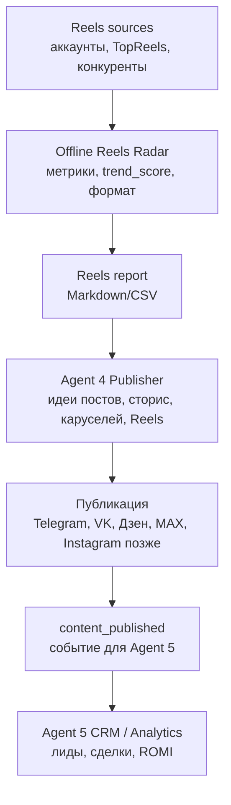

# Supabase и Reels Radar — план расширения

Дата: 2026-05-06

Проект: `design-studio-lead-engine`

Статус: план расширения, код не меняется.

## 1. Главная идея

Сейчас MVP не нужно усложнять. Нам важно сначала запустить базовую систему лидов:

- заполнить `.env`;
- запустить Redis;
- проверить Telegram-сессии;
- проверить Bitrix24;
- убедиться, что лид проходит путь `источник -> обработка -> CRM`.

Но архитектуру нельзя закрывать только под локальные CSV-файлы. В будущем системе понадобится нормальное постоянное хранилище для лидов, каналов, публикаций, Reels-анализа и сквозной аналитики.

Правильное решение: рассматривать Supabase не как вторую чужую базу, а как возможную облачную PostgreSQL-базу проекта.

## 2. Как Supabase может стать основной PostgreSQL-базой

В проекте уже есть слой постоянного хранения в `shared/db.py`.

Там используется:

- `DATABASE_URL`;
- SQLAlchemy;
- таблицы `leads`, `duplicates`, `agent_logs`;
- ленивая инициализация, чтобы проект не падал без базы на этапе импорта.

Supabase подходит сюда естественно, потому что Supabase предоставляет PostgreSQL connection string. То есть в будущем можно указать Supabase-строку подключения в `.env` как `DATABASE_URL`, и проект будет работать с Supabase как с обычным PostgreSQL.

Важное разделение:

| Вариант | Что это значит | Когда использовать |
|---|---|---|
| `DATABASE_URL` | Прямое подключение к PostgreSQL через SQLAlchemy | Основной путь для нашего Python-проекта |
| `SUPABASE_URL` + `SUPABASE_KEY` | Работа через Supabase API/PostgREST | Позже, если понадобится Storage, Auth, Realtime или API-доступ |

Для нашего проекта в первую очередь нужен именно `DATABASE_URL`, а не отдельный `supabase-py` слой. Это не плодит вторую систему хранения и сохраняет текущую архитектуру.

Проверка по актуальной документации Supabase через Context7: Supabase поддерживает подключение к Supabase Postgres через `DATABASE_URL`; `supabase-py` работает через API-ключи и PostgREST, а не как прямое SQL-подключение.

## 3. Текущие уровни хранения

| Уровень | Для чего нужен сейчас | Что будет потом |
|---|---|---|
| Redis | Очереди между агентами | Остаётся для быстрых событий и временных задач |
| PostgreSQL / Supabase Postgres | Постоянное хранение лидов, логов, аналитики | Станет главным хранилищем данных |
| Bitrix24 | CRM для менеджера | Остаётся рабочим местом продаж |
| CSV | MVP-отчёты и ручная проверка формул | Потом переносится в таблицы PostgreSQL |
| Markdown | Исследования и понятные отчёты | Остаётся для документации и человекочитаемых сводок |

## 4. Таблицы, которые нужны проекту

### 4.1. Лиды и CRM

| Таблица | Зачем нужна | Кто заполняет |
|---|---|---|
| `leads` | Все квалифицированные лиды | Агент 3, Агент 5 |
| `raw_leads` | Сырые входящие до обработки | Агент 2, Агент 6 |
| `lead_scores` | История скоринга и причин оценки | Агент 3 |
| `crm_events` | Создание лида, сделки, задачи, заметки в CRM | Агент 5 |
| `duplicates` | Отпечатки дублей | Агент 3 |
| `agent_logs` | Логи работы агентов | Все агенты |

Сейчас в коде уже есть `leads`, `duplicates`, `agent_logs`. Остальные таблицы можно добавить позже, когда появится реальный поток данных.

### 4.2. Каналы и сквозная аналитика

| Таблица | Зачем нужна | Кто заполняет |
|---|---|---|
| `traffic_channels` | Справочник каналов: Telegram, Avito, VK, Дзен, Ads, SEO | Вручную, Агент 5 |
| `channel_costs` | Расходы по каналам | Вручную, позже API/импорт |
| `channel_facts` | Лиды, квалификации, встречи, сделки, выручка | Агент 5 |
| `attribution_events` | События пути клиента: визит, лид, заявка, сделка | Агент 2, Агент 4, Агент 5 |
| `channel_reports` | Расчёты CPL, CAC, ROMI, окупаемости | Агент 5 |

Сейчас эти данные уже частично живут в CSV:

- `content/library/sources/channel-registry-mvp.csv`;
- `data/channel_costs_mvp.csv`;
- `data/channel_facts_mvp.csv`;
- `data/reports/channel_report_mvp.csv`.

В будущем эти CSV можно перенести в PostgreSQL/Supabase.

### 4.3. Контент и публикации

| Таблица | Зачем нужна | Кто заполняет |
|---|---|---|
| `content_items` | Черновики постов, каруселей, сторис, видео | Агент 4 |
| `content_publications` | Факт публикации: канал, ссылка, дата, статус | Агент 4 |
| `content_events` | События контента для CRM и аналитики | Агент 4, Агент 5 |
| `content_performance` | Просмотры, клики, реакции, лиды от контента | Агент 5, позже API |

Сейчас у проекта уже есть событие `content_published` и очередь `content:published`. Это хорошая основа для будущей связки `контент -> лид -> сделка -> ROMI`.

### 4.4. Reels Radar

| Таблица | Зачем нужна | Кто заполняет |
|---|---|---|
| `reels_sources` | Где смотрим тренды: аккаунты, TopReels, конкуренты | Агент 1, вручную |
| `reels_items` | Данные по ролику: ссылка, автор, просмотры, лайки | Offline radar, позже Apify |
| `reels_scores` | `trend_score` и причины оценки | Offline radar |
| `reels_analysis` | Хук, формат, визуальная идея, почему сработало | Агент 4, позже LLM |
| `content_ideas` | Идеи для постов/сторис/Reels на основе трендов | Агент 4 |
| `content_reel_links` | Какая идея/публикация родилась из какого Reels | Агент 4, Агент 5 |

## 5. Что внедряем сейчас

Сейчас внедряем только самый безопасный и полезный слой:

1. Документируем путь расширения.
2. Создаём план таблиц.
3. Позже добавляем минимальный offline Reels radar без внешних API.
4. Сохраняем отчёт Reels в Markdown/CSV.
5. Используем результат как вход для Агента 4.

Минимальный offline Reels radar должен уметь:

- принимать вручную заданные Reels или стартовый список примеров;
- хранить ссылку, автора, тему, просмотры, лайки, комментарии, подпись;
- считать `trend_score`;
- описывать хук первых секунд;
- описывать формат ролика;
- объяснять, почему ролик может сработать;
- предлагать, как повторить формат для студии проектирования;
- создавать отчёт Markdown/CSV.

## 6. Что оставляем на потом

На потом оставляем всё, что требует внешних ключей, сложной инфраструктуры или проверки правил площадок:

- Apify live-сбор Reels;
- автоматический сбор Instagram-метаданных;
- скачивание видео;
- `ffmpeg`;
- извлечение кадров;
- анализ аудио;
- транскрибация;
- хранение медиафайлов;
- Supabase Storage;
- Supabase Realtime;
- отдельный API-доступ через `supabase-py`;
- автоматическая связь Reels-тренда с опубликованным контентом и ROMI.

Это не отменяется. Это просто второй и третий этаж после запуска MVP.

## 7. Как offline Reels radar связан с Агентом 4

Агент 4 отвечает за контент и точки доверия.

Offline Reels radar становится для него разведкой форматов:



Простыми словами:

1. Мы смотрим, какие Reels уже работают.
2. Не копируем их слепо.
3. Вынимаем механику: хук, тема, формат, эмоция, структура.
4. Передаём Агенту 4 как сырьё для собственного контента студии.
5. Потом Агент 5 смотрит, дал ли этот контент лиды и деньги.

## 8. Как это связано со сквозной аналитикой

Идеальная будущая цепочка:

```text
reels_source -> content_idea -> content_publication -> first_touch -> lead -> deal -> revenue -> ROMI
```

Это значит, что мы сможем отвечать не только на вопрос "какой канал дал лиды", но и на более сильный вопрос:

```text
какая идея контента дала лиды, сделки и выручку
```

Для студии проектирования это важно, потому что разные темы могут приводить разных клиентов:

- перепланировки;
- проектирование МКД;
- КР/КЖ/КМ;
- согласование;
- ошибки ремонта;
- ипотека и документы;
- кейсы до/после;
- B2B-партнёрство с архитекторами и застройщиками.

## 9. Минимальный порядок внедрения

### Этап 1 — сейчас

- Оставить MVP без усложнения.
- Зафиксировать план Supabase/Reels.
- Не подключать внешние API.
- Не менять рабочий код.

### Этап 2 — после базового запуска MVP

- Добавить offline Reels radar в Agent 4.
- Сделать dry-run отчёт Markdown/CSV.
- Подготовить первые 10-20 Reels/форматов вручную.
- Превратить лучшие форматы в идеи контента.

### Этап 3 — после появления публикаций и первых лидов

- Сохранять `content_publications`.
- Связывать публикации с входящими лидами.
- Считать ROMI не только по каналам, но и по контенту.

### Этап 4 — после стабилизации

- Подключить Supabase как PostgreSQL через `DATABASE_URL`.
- Перенести CSV-аналитику в таблицы.
- Добавить миграции и безопасную схему.
- Проверить доступы и не показывать секреты.

### Этап 5 — расширение Reels

- Подключить Apify или другой легальный источник метаданных.
- Добавить анализ кадров/аудио/транскрибацию.
- Добавить автоматический генератор идей для Агента 4.
- Считать ROMI по связке `Reels idea -> content -> lead -> deal`.

## 10. Правила безопасности и качества

- Не хранить секреты в документах.
- Не показывать значения `.env`.
- Не добавлять вторую базу, если Supabase используется как PostgreSQL через `DATABASE_URL`.
- Не скачивать массово видео без отдельного решения.
- Не запускать внешние API без токенов и отдельной проверки.
- Не ломать текущий MVP ради будущего расширения.
- Сначала запуск лидовой цепочки, потом расширение контент-аналитики.

## 11. Ближайший маленький шаг

Следующий шаг после этого документа:

```text
Сначала вернуться к запуску MVP: безопасно заполнить .env, проверить Redis, Telegram-сессии и Bitrix24.
```

Если пользователь отдельно подтвердит работу именно по Reels, тогда следующий Reels-шаг:

```text
Создать минимальный offline Reels radar для Агента 4 без внешних API и без изменения основной лидовой цепочки.
```
